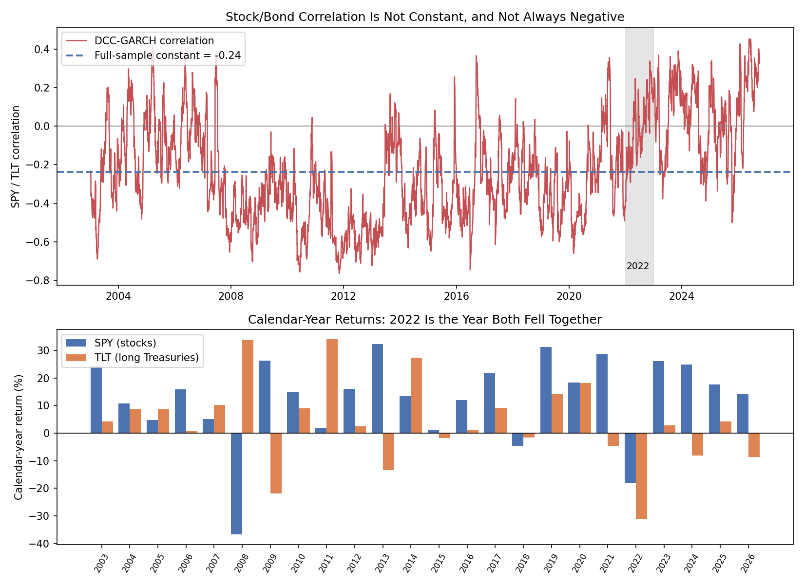

# DCC-GARCH Calculator — Multi-Asset Volatility and Time-Varying Correlation

A from-scratch Python implementation of the DCC-GARCH model (Engle, 2002) for
multi-asset portfolio risk, plus a rolling backtest that compares it against three
simpler covariance models on real market data.

Part of a market-risk series:
[var-calculator](https://github.com/ducksmell-sys/var-calculator) ·
[ewma-calculator](https://github.com/ducksmell-sys/ewma-calculator) ·
[garch-calculator](https://github.com/ducksmell-sys/garch-calculator) ·
[var-backtester](https://github.com/ducksmell-sys/var-backtester)

## Why DCC?

Portfolio risk depends on correlations as well as individual volatilities. For two
assets with 2% and 3% daily volatility held 50/50, moving the correlation from 0.3 to
0.9 raises the 95% VaR from about 3.35% to 4.01% — roughly 20% more risk with no
change in either asset's own volatility. Correlations are not constant: they tend to
jump in crises, and even change sign (see the stock/bond result below). DCC-GARCH
models that explicitly.

## The Model

The conditional covariance matrix is split into volatilities and correlations:

```
H_t = D_t · R_t · D_t          D_t = diag(σ_1t, ..., σ_nt)

σ²_it = ω_i + α_i · r²_i,t-1 + β_i · σ²_i,t-1        (univariate GARCH(1,1) per asset)
z_t   = r_t / σ_t                                     (standardized residuals)

Q_t = (1 - a - b) · Q̄ + a · z_t-1 z'_t-1 + b · Q_t-1  (correlation dynamics)
R_t = diag(Q_t)^-1/2 · Q_t · diag(Q_t)^-1/2           (rescale to a correlation matrix)
```

- `Q̄` is the long-run correlation structure (the role ω plays in GARCH)
- `a`, `b` are the correlation analogues of α, β; stationarity needs `a + b < 1`
- Setting `a = b = 0` gives the constant-correlation model (CCC-GARCH)
- Portfolio variance is `w' H_t w`, and VaR uses the usual parametric formula

Estimation is two-step: fit each asset's GARCH(1,1) by maximum likelihood, then fit
`(a, b)` on the standardized residuals with the correlation part of the likelihood.
Both recursions are written as linear filters (`scipy.signal.lfilter`), so a full
rolling backtest runs in about 20 seconds.

## Files

| File | Description |
|---|---|
| `dcc_garch.py` | Core model: `fit_dcc_garch`, `dcc_filter`, `forecast_next`, `portfolio_var`. Running it validates the model on simulated data with a known correlation jump |
| `dcc_backtest_data.py` | Downloads real prices (yfinance) and backtests Static, EWMA, CCC-GARCH and DCC-GARCH portfolio VaR |
| `stock_bond_regimes.py` | DCC-GARCH on SPY and TLT since 2003: year-by-year stock/bond correlation and returns (Result 4) |
| `risk_tests.py` | Kupiec coverage test and Christoffersen independence test (same as in var-backtester) |

## Usage

```bash
pip install numpy scipy pandas yfinance matplotlib

python dcc_garch.py                      # validation on simulated data
python dcc_backtest_data.py              # SPY / TLT / GLD, equal weight, 95% VaR
python dcc_backtest_data.py --tickers SPY TLT --weights 0.6 0.4 --confidence 0.99
python stock_bond_regimes.py             # stock/bond correlation by year, 2003 onward
```

```python
from dcc_garch import fit_dcc_garch, forecast_next, portfolio_var

model = fit_dcc_garch(returns)                       # returns: (T, n) array of daily returns
sigma, corr = forecast_next(returns, model)          # tomorrow's volatilities and correlation matrix
portfolio_var(weights, sigma, corr, confidence=0.95, portfolio_value=1_000_000)
```

## Result 1: Does the model recover a known correlation shift?

Simulated data: 3 assets, correlation 0.2 and 1% volatility, then a 100-day crisis
(correlation 0.85, 2.5% volatility), then calm again.

```
DCC parameters: a=0.0449, b=0.9421, a+b=0.9870

Period                  True rho  DCC estimate  Constant (CCC)
Calm (days 100-300)         0.20          0.20            0.38
Crisis (days 320-400)       0.85          0.78            0.38
Calm again (days 500-700)   0.20          0.32            0.38
```


DCC picks up the jump (0.78 against a true 0.85) while the constant model reports 0.38
throughout, which is wrong in both regimes. The estimate is noisy, and it decays slowly
after the crisis (0.32 against a true 0.20) because `a + b` is close to 1.

## Result 2: Real data (SPY, TLT, GLD, equal weight)

Rolling backtest, 1,950 days (2018-12-31 to 2026-10-02), 500-day estimation window,
GARCH models refit every 20 days with no look-ahead. 95% one-day VaR:

```
Model        Viol.    Rate  Kupiec p  Indep. p     CC p   Avg VaR
Static         107   5.49%    0.3308    0.2018   0.2760    1.051%
EWMA            97   4.97%    0.9585    0.3497   0.6449    1.069%
CCC-GARCH      112   5.74%    0.1407    0.8538   0.3321    1.044%
DCC-GARCH      108   5.54%    0.2832    0.6619   0.5109    1.056%
(expected violation rate: 5.0%; p < 0.05 means reject the model)
```


The correlation chart is the most informative part. The stock/bond correlation
(SPY/TLT) was mostly negative before 2021 (down to about -0.5 around the Covid crash).
From mid-2021 it moved higher and has spent most of the time since above zero, with
several dips below it (2022, 2023, 2025), reaching about +0.3 in 2026. The constant
model's single number (-0.08) describes neither period. This is the kind of structural change
that makes a fixed correlation assumption dangerous for a stock/bond portfolio.


## Result 3: Other configurations

Same backtest, different portfolios and confidence levels (violation rate, with the
p-value of the combined Conditional Coverage test in brackets):

| Portfolio | Confidence | Static | EWMA | CCC-GARCH | DCC-GARCH |
|---|---|---|---|---|---|
| SPY/TLT 60/40 | 95% | 4.67% (0.011) | 5.03% (0.884) | 5.23% (0.141) | 5.03% (0.884) |
| SPY/TLT/GLD equal | 99% | 2.15% (0.000) | 1.90% (0.001) | 2.05% (0.000) | 1.90% (0.002) |
| SPY/TLT 60/40 | 99% | 1.64% (0.000) | 2.21% (0.000) | 2.15% (0.000) | 2.00% (0.001) |

## Result 4: Is the stock/bond correlation really negative?

The textbook claim behind the 60/40 portfolio is that bonds hedge stocks. To test it,
`stock_bond_regimes.py` fits DCC-GARCH to SPY (stocks) and TLT (long Treasuries) over
2003-01-03 to 2026-10-05 (5,976 days; TLT's history starts in 2002) and tabulates each
calendar year.

| Period | In-year correlation | What happened |
|---|---|---|
| 2004 - 2006 | -0.04 to +0.05 | Near zero |
| 2007 - 2021 | -0.14 to -0.71, negative every year | 2008: SPY -36.8%, TLT +34.0%. The hedge worked |
| 2022 | +0.08 | SPY -18.2%, TLT -31.2%, 60/40 -22.8% |
| 2023 - 2026 | +0.06 to +0.36, positive every year | 2026 is a partial year (through Oct 5) |



<details>
<summary>Full year-by-year table</summary>

```
Year    Days  DCC corr  Sample corr      SPY      TLT    60/40
2003     251     -0.28        -0.29    24.2%     4.3%    16.5%
2004     252     -0.10        -0.04    10.7%     8.7%    10.2%
2005     252     -0.03        +0.01     4.8%     8.6%     6.6%
2006     251     -0.01        +0.05    15.8%     0.7%     9.7%
2007     251     -0.27        -0.39     5.1%    10.3%     7.8%
2008     253     -0.47        -0.48   -36.8%    34.0%   -11.8%
2009     252     -0.31        -0.32    26.4%   -21.8%     6.0%
2010     252     -0.45        -0.55    15.1%     9.0%    13.8%
2011     252     -0.50        -0.71     1.9%    34.0%    15.9%
2012     250     -0.55        -0.65    16.0%     2.4%    11.1%
2013     252     -0.29        -0.21    32.3%   -13.4%    12.2%
2014     252     -0.36        -0.46    13.5%    27.3%    19.3%
2015     252     -0.33        -0.37     1.2%    -1.8%     0.8%
2016     252     -0.30        -0.37    12.0%     1.2%     8.1%
2017     251     -0.29        -0.33    21.7%     9.2%    16.8%
2018     251     -0.22        -0.28    -4.6%    -1.6%    -2.9%
2019     252     -0.38        -0.46    31.2%    14.1%    24.7%
2020     253     -0.37        -0.48    18.3%    18.2%    21.5%
2021     252     -0.13        -0.14    28.7%    -4.6%    14.8%
2022     251     -0.01        +0.08   -18.2%   -31.2%   -22.8%
2023     250     +0.07        +0.13    26.2%     2.8%    16.9%
2024     252     +0.01        +0.06    24.9%    -8.1%    10.9%
2025     250     -0.04        +0.10    17.7%     4.2%    12.8%
2026     190     +0.22        +0.36    14.2%    -8.7%     4.6%
```

"DCC corr" is the yearly average of the DCC-GARCH series, "Sample corr" is the plain
correlation of that year's daily returns, and 60/40 is a daily-rebalanced mix.
</details>

What the data shows:

- **Negative in most years, but not all.** 17 of 24 calendar years had a negative
  in-year correlation, and the full-sample constant is -0.24. A model that hard-codes
  that number is right on average and wrong in the years that matter.
- **The sign flipped in 2022 and stayed positive.** Every year from 2022 on has a
  positive in-year correlation. In 2022 stocks and long bonds fell together, and the
  60/40 portfolio lost 22.8%, nearly twice its loss in 2008 (-11.8%) and the worst
  calendar year in this sample. The only other year both fell was 2018, by a small amount.
- **The hedge is not guaranteed even when the correlation is negative.** TLT lost 21.8%
  in 2009 and 13.4% in 2013 while stocks rose. A negative correlation helps in the
  years stocks fall, not in every year.
- **DCC lags the flip.** Its yearly average was -0.01 in 2022 against +0.08 realized,
  and -0.04 in 2025 against +0.10. With `a + b = 0.987` the estimate decays slowly, so
  after a long negative stretch it takes time to turn positive. This is the cost of
  smoothing, and it is why a stress test with a stock/bond correlation of +0.5
  belongs next to the model rather than being replaced by it.

Why the sign changes is not tested here. The usual explanation in the literature is
which kind of shock dominates: growth shocks push stocks down and bond prices up
(negative correlation), while inflation and interest-rate shocks push both down
(positive correlation). Longer histories are also reported to show positive
correlations before the 2000s, but this data starts in 2003 and cannot confirm that.

## What the results do and don't show

- **DCC did not statistically beat EWMA.** At 95% on the equal-weight portfolio, all
  four models pass every test, and EWMA has the best violation rate (4.97%). On the
  60/40 portfolio, EWMA and DCC-GARCH tie. For one-day VaR on a few liquid assets, a
  RiskMetrics-style EWMA covariance is hard to beat, which is consistent with how it is
  used in practice.
- **The static model fails when correlations drift.** On the 60/40 portfolio its
  violations cluster in time (independence test p = 0.0035), so it is rejected, while
  the dynamic models are not.
- **At 99%, every model is rejected** (about 2% violations against 1% expected). All
  of them assume normally distributed shocks, which understates fat tails. DCC models
  how correlations move, not the shape of the tails. Student-t innovations or filtered
  historical simulation are the natural next step.
- These tests judge each model against its own target. They are not formal pairwise
  comparisons between models, so small differences in violation rates should not be
  over-read.

## Limitations

- One `(a, b)` pair is shared by all asset pairs (the standard DCC restriction)
- Zero-mean returns and normal innovations
- Q̄ is estimated from the data, which becomes noisy with many assets; DCC as written
  is practical for a handful to a few dozen assets
- No asymmetric correlation response (ADCC would add it)
