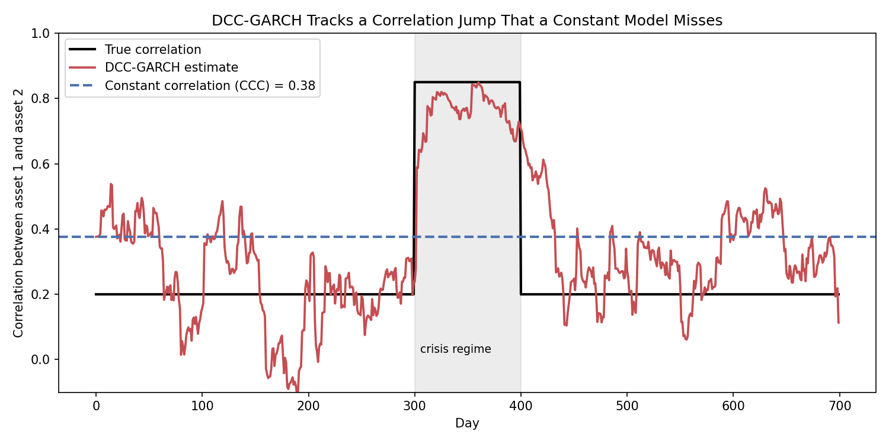
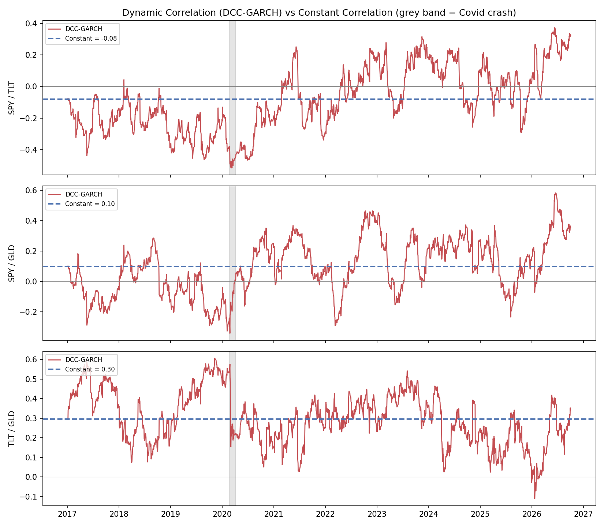
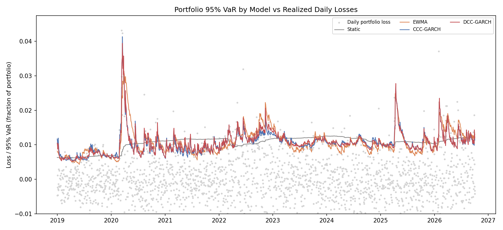
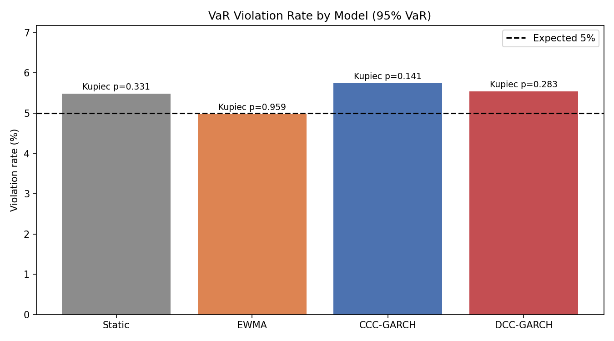

# DCC-GARCH Calculator — Multi-Asset Volatility and Time-Varying Correlation

A from-scratch Python implementation of the DCC-GARCH model (Engle, 2002) for
multi-asset portfolio risk, plus a rolling backtest that compares it against three
simpler covariance models on real market data.

Part of a market-risk series:
[var-calculator](https://github.com/ducksmell-sys/var-calculator) ·
[ewma-calculator](https://github.com/ducksmell-sys/ewma-calculator) ·
[garch-calculator](https://github.com/ducksmell-sys/garch-calculator) ·
[var-backtester](https://github.com/ducksmell-sys/var-backtester)

## Why DCC?

Portfolio risk depends on correlations as well as individual volatilities. For two
assets with 2% and 3% daily volatility held 50/50, moving the correlation from 0.3 to
0.9 raises the 95% VaR from about 3.35% to 4.01% — roughly 20% more risk with no
change in either asset's own volatility. Correlations are not constant: they tend to
jump in crises, and even change sign (see the stock/bond result below). DCC-GARCH
models that explicitly.

## The Model

The conditional covariance matrix is split into volatilities and correlations:

```
H_t = D_t · R_t · D_t          D_t = diag(σ_1t, ..., σ_nt)

σ²_it = ω_i + α_i · r²_i,t-1 + β_i · σ²_i,t-1        (univariate GARCH(1,1) per asset)
z_t   = r_t / σ_t                                     (standardized residuals)

Q_t = (1 - a - b) · Q̄ + a · z_t-1 z'_t-1 + b · Q_t-1  (correlation dynamics)
R_t = diag(Q_t)^-1/2 · Q_t · diag(Q_t)^-1/2           (rescale to a correlation matrix)
```

- `Q̄` is the long-run correlation structure (the role ω plays in GARCH)
- `a`, `b` are the correlation analogues of α, β; stationarity needs `a + b < 1`
- Setting `a = b = 0` gives the constant-correlation model (CCC-GARCH)
- Portfolio variance is `w' H_t w`, and VaR uses the usual parametric formula

Estimation is two-step: fit each asset's GARCH(1,1) by maximum likelihood, then fit
`(a, b)` on the standardized residuals with the correlation part of the likelihood.
Both recursions are written as linear filters (`scipy.signal.lfilter`), so a full
rolling backtest runs in about 20 seconds.

## Files

| File | Description |
|---|---|
| `dcc_garch.py` | Core model: `fit_dcc_garch`, `dcc_filter`, `forecast_next`, `portfolio_var`. Running it validates the model on simulated data with a known correlation jump |
| `dcc_backtest_data.py` | Downloads real prices (yfinance) and backtests Static, EWMA, CCC-GARCH and DCC-GARCH portfolio VaR |
| `risk_tests.py` | Kupiec coverage test and Christoffersen independence test (same as in var-backtester) |

## Usage

```bash
pip install numpy scipy pandas yfinance matplotlib

python dcc_garch.py                      # validation on simulated data
python dcc_backtest_data.py              # SPY / TLT / GLD, equal weight, 95% VaR
python dcc_backtest_data.py --tickers SPY TLT --weights 0.6 0.4 --confidence 0.99
```

```python
from dcc_garch import fit_dcc_garch, forecast_next, portfolio_var

model = fit_dcc_garch(returns)                       # returns: (T, n) array of daily returns
sigma, corr = forecast_next(returns, model)          # tomorrow's volatilities and correlation matrix
portfolio_var(weights, sigma, corr, confidence=0.95, portfolio_value=1_000_000)
```

## Result 1: Does the model recover a known correlation shift?

Simulated data: 3 assets, correlation 0.2 and 1% volatility, then a 100-day crisis
(correlation 0.85, 2.5% volatility), then calm again.

```
DCC parameters: a=0.0449, b=0.9421, a+b=0.9870

Period                  True rho  DCC estimate  Constant (CCC)
Calm (days 100-300)         0.20          0.20            0.38
Crisis (days 320-400)       0.85          0.78            0.38
Calm again (days 500-700)   0.20          0.32            0.38
```



DCC picks up the jump (0.78 against a true 0.85) while the constant model reports 0.38
throughout, which is wrong in both regimes. The estimate is noisy, and it decays slowly
after the crisis (0.32 against a true 0.20) because `a + b` is close to 1.

## Result 2: Real data (SPY, TLT, GLD, equal weight)

Rolling backtest, 1,950 days (2018-12-31 to 2026-10-02), 500-day estimation window,
GARCH models refit every 20 days with no look-ahead. 95% one-day VaR:

```
Model        Viol.    Rate  Kupiec p  Indep. p     CC p   Avg VaR
Static         107   5.49%    0.3308    0.2018   0.2760    1.051%
EWMA            97   4.97%    0.9585    0.3497   0.6449    1.069%
CCC-GARCH      112   5.74%    0.1407    0.8538   0.3321    1.044%
DCC-GARCH      108   5.54%    0.2832    0.6619   0.5109    1.056%
(expected violation rate: 5.0%; p < 0.05 means reject the model)
```



The correlation chart is the most informative part. The stock/bond correlation
(SPY/TLT) was mostly negative before 2021 (down to about -0.5 around the Covid crash).
From mid-2021 it moved higher and has spent most of the time since above zero, with
several dips below it (2022, 2023, 2025), reaching about +0.3 in 2026. The constant
model's single number (-0.08) describes neither period. This is the kind of structural change
that makes a fixed correlation assumption dangerous for a stock/bond portfolio.





## Result 3: Other configurations

Same backtest, different portfolios and confidence levels (violation rate, with the
p-value of the combined Conditional Coverage test in brackets):

| Portfolio | Confidence | Static | EWMA | CCC-GARCH | DCC-GARCH |
|---|---|---|---|---|---|
| SPY/TLT 60/40 | 95% | 4.67% (0.011) | 5.03% (0.884) | 5.23% (0.141) | 5.03% (0.884) |
| SPY/TLT/GLD equal | 99% | 2.15% (0.000) | 1.90% (0.001) | 2.05% (0.000) | 1.90% (0.002) |
| SPY/TLT 60/40 | 99% | 1.64% (0.000) | 2.21% (0.000) | 2.15% (0.000) | 2.00% (0.001) |

## What the results do and don't show

- **DCC did not statistically beat EWMA.** At 95% on the equal-weight portfolio, all
  four models pass every test, and EWMA has the best violation rate (4.97%). On the
  60/40 portfolio, EWMA and DCC-GARCH tie. For one-day VaR on a few liquid assets, a
  RiskMetrics-style EWMA covariance is hard to beat, which is consistent with how it is
  used in practice.
- **The static model fails when correlations drift.** On the 60/40 portfolio its
  violations cluster in time (independence test p = 0.0035), so it is rejected, while
  the dynamic models are not.
- **At 99%, every model is rejected** (about 2% violations against 1% expected). All
  of them assume normally distributed shocks, which understates fat tails. DCC models
  how correlations move, not the shape of the tails. Student-t innovations or filtered
  historical simulation are the natural next step.
- These tests judge each model against its own target. They are not formal pairwise
  comparisons between models, so small differences in violation rates should not be
  over-read.

## Limitations

- One `(a, b)` pair is shared by all asset pairs (the standard DCC restriction)
- Zero-mean returns and normal innovations
- Q̄ is estimated from the data, which becomes noisy with many assets; DCC as written
  is practical for a handful to a few dozen assets
- No asymmetric correlation response (ADCC would add it)
