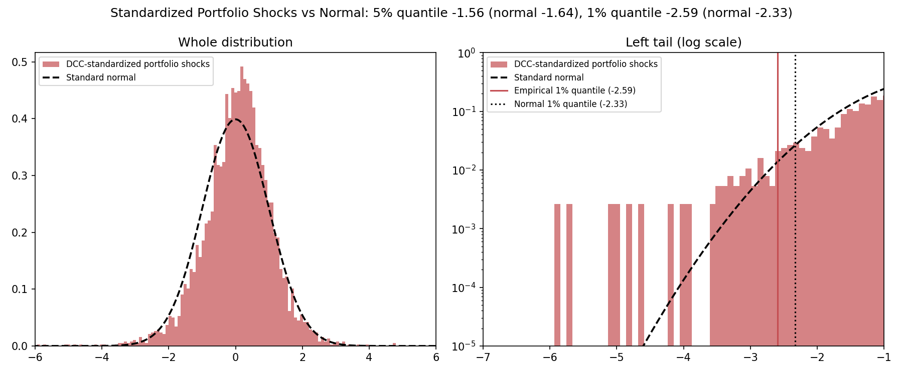
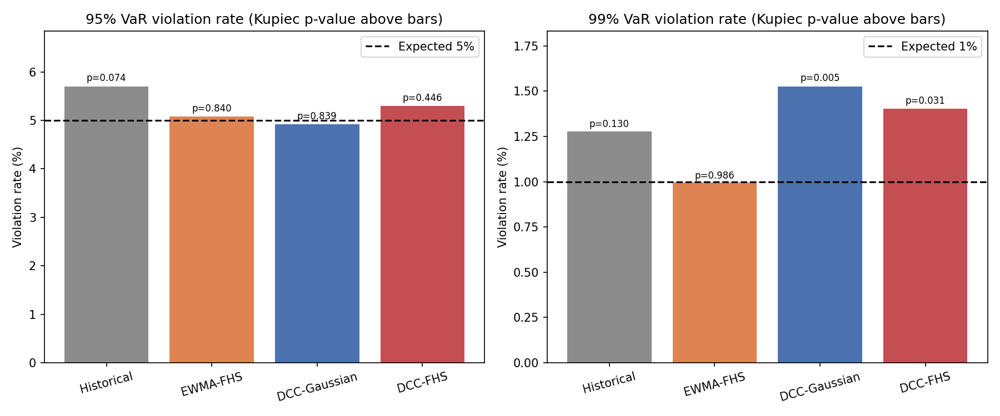
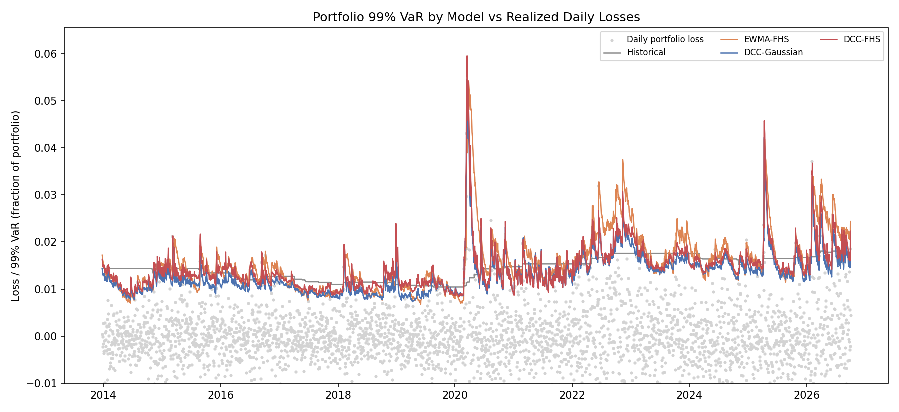

# Filtered Historical Simulation (FHS) on DCC-GARCH

An attempt to fix the problem the main [README](README.md) ended on: at 99% confidence,
every Gaussian VaR model was rejected by the backtest (about 2% violations against 1%
expected). Filtered Historical Simulation keeps the DCC-GARCH volatility and correlation
forecasts but replaces the normal quantile with the empirical quantile of the model's own
standardized shocks.

## Method

Gaussian VaR is `z * sigma_p * V` with `z = 2.33` at 99%. FHS instead does this:

1. **Filter**: divide each historical portfolio return by that day's DCC-GARCH portfolio
   volatility, giving standardized shocks that are roughly identically distributed.
2. **Keep the shape**: take the empirical lower quantile of the last `shock_window`
   shocks (fat tails included) instead of the normal one.
3. **Rescale**: multiply by tomorrow's forecast volatility.

Two implementations in `fhs_var.py`:

| Function | What it does |
|---|---|
| `standardized_portfolio_shocks` + `fhs_var_from_shocks` | Portfolio-level FHS for a fixed set of weights. Fast, used in the backtest |
| `fhs_simulate_portfolio_returns` | Full multivariate FHS: removes volatility and correlation (`e_t = L_t^-1 r_t / sigma_t`, with `R_t = L_t L_t'`), resamples whole days of shocks, then puts tomorrow's volatility and correlation back. Works for any weights, so the same scenarios can be reused for what-if portfolios |

The two agree to within 2% in five of the six next-day VaR comparisons run for this
README (0.1% to 2.0%), and within 5.3% in the worst case (a 95% VaR with a 2,000-day shock
window).

## Models compared

| Model | Volatility used | Quantile |
|---|---|---|
| Historical | none (raw returns) | empirical, last 1,000 portfolio returns |
| EWMA-FHS | EWMA (lambda = 0.94) | empirical, EWMA-standardized shocks |
| DCC-Gaussian | DCC-GARCH | normal |
| DCC-FHS | DCC-GARCH | empirical, DCC-standardized shocks |

Historical shows what happens with no filtering at all. EWMA-FHS is there to separate
"does FHS help?" from "does DCC help?".

## Usage

```bash
pip install numpy scipy pandas yfinance matplotlib

python fhs_backtest_data.py --end 2026-10-01
python fhs_backtest_data.py --end 2026-10-01 --tickers SPY TLT --weights 0.6 0.4
python fhs_backtest_data.py --end 2026-10-01 --start 2005-01-01 --shock-window 2000
```

```python
from dcc_garch import fit_dcc_garch
from fhs_var import fhs_var_simulated

model = fit_dcc_garch(returns[-500:])
fhs_var_simulated(returns[-1000:], weights, model, confidence=0.99, portfolio_value=1_000_000, seed=0)
```

Pass `--end` if you want to reproduce the numbers below. Without it the last row is
today's intraday price, and Yahoo also revises adjusted prices over time, so counts can
move by a violation or two between download dates (the DCC-Gaussian 95% count ranged
from 158 to 159 across reruns while writing this).

## Why FHS can help: the shocks are not normal



After DCC-GARCH standardizes the portfolio returns, the left tail is fatter than the
normal at the 1% point (quantile -2.59 against -2.33) but slightly milder at the 5% point
(-1.56 against -1.64). So FHS should raise the 99% VaR and lower the 95% VaR relative to
Gaussian, and it does. For the final day in the data (next-day VaR on 1,000,000):

```
95%: Gaussian 12,767 | FHS 11,935 (portfolio-level) | FHS 12,170 (full simulation)
99%: Gaussian 18,056 | FHS 19,710 (portfolio-level) | FHS 19,945 (full simulation)
```

## Results: SPY / TLT / GLD, equal weight

Rolling backtest, 3,210 days (2013-12-24 to 2026-09-30), GARCH/DCC fit on the last 500
days and refit every 20 days, shocks taken from the last 1,000 days, no look-ahead.

```
--- 95% VaR (expected violation rate 5.0%) ---
Model          Viol.    Rate  Kupiec p  Indep. p     CC p   Avg VaR
Historical       183   5.70%    0.0744    0.0008   0.0007    0.874%
EWMA-FHS         163   5.08%    0.8399    0.1988   0.4291    0.924%
DCC-Gaussian     158   4.92%    0.8392    0.2501   0.5056    0.936%
DCC-FHS          170   5.30%    0.4459    0.1012   0.1952    0.903%

--- 99% VaR (expected violation rate 1.0%) ---
Model          Viol.    Rate  Kupiec p  Indep. p     CC p   Avg VaR
Historical        41   1.28%    0.1301    0.0158   0.0172    1.435%
EWMA-FHS          32   1.00%    0.9858    0.0413   0.1248    1.569%
DCC-Gaussian      49   1.53%    0.0054    0.7784   0.0200    1.324%
DCC-FHS           45   1.40%    0.0310    0.6637   0.0887    1.447%
```

(Kupiec = violation rate, Indep. = violations not clustered, CC = both together. A
p-value below 0.05 rejects the model.)





## Does it hold up? Three setups

Violation rate, with the Conditional Coverage p-value in brackets (below 0.05 means
rejected):

| 99% VaR | Historical | EWMA-FHS | DCC-Gaussian | DCC-FHS |
|---|---|---|---|---|
| A: SPY/TLT/GLD equal, 2013-2026, 1,000-day shocks | 1.28% (0.017) | 1.00% (0.125) | 1.53% (0.020) | 1.40% (0.089) |
| B: SPY/TLT 60/40, 2013-2026 | 1.18% (0.000) | 1.15% (0.002) | 1.81% (0.000) | 1.18% (0.022) |
| C: SPY/TLT/GLD equal, 2012-2026, 2,000-day shocks | 1.30% (0.018) | 1.15% (0.026) | 1.61% (0.001) | 1.38% (0.093) |

| 95% VaR | Historical | EWMA-FHS | DCC-Gaussian | DCC-FHS |
|---|---|---|---|---|
| A | 5.70% (0.001) | 5.08% (0.429) | 4.92% (0.506) | 5.30% (0.195) |
| B | 5.83% (0.000) | 5.17% (0.010) | 5.14% (0.021) | 5.26% (0.013) |
| C | 6.02% (0.000) | 5.22% (0.176) | 5.07% (0.393) | 5.65% (0.076) |

## What the results do and don't show

- **FHS lowers the 99% violation rate but does not fully fix it.** Against DCC-Gaussian
  it goes 1.53% to 1.40%, 1.81% to 1.18% and 1.61% to 1.38% across the three setups.
  DCC-Gaussian is rejected by the Kupiec test in all three, while DCC-FHS passes it only in
  B (p = 0.031, 0.309 and 0.032). Its combined test passes in A and C and fails in B.
- **At 95% FHS does not help.** Gaussian is already well calibrated there, and the
  standardized shocks are slightly milder than normal at that point, so FHS just moves
  the VaR down. DCC-FHS ends up a little worse than DCC-Gaussian in all three setups,
  though not significantly.
- **Filtering matters more than the quantile.** Unfiltered Historical simulation gets a
  reasonable 99% violation rate but its violations cluster in time (independence test
  p = 0.016, 0.000, 0.022), and it is rejected at 95% in every setup on the combined
  test. It cannot react to volatility regimes.
- **DCC did not clearly beat EWMA.** EWMA-FHS has the violation rate closest to 1% in every
  setup (1.00%, 1.15%, 1.15%), but its violations cluster (independence p = 0.041, 0.001,
  0.011). DCC-FHS clusters less in A and C (p = 0.66, 0.70) but not in B (p = 0.010).
  That matches the main README: for one-day VaR on a few liquid assets, a simple EWMA
  volatility is hard to beat.
- **The result depends on the sample.** In setup B at 95%, all four models fail the
  clustering test over 2013-2026, while the shorter 2018-2026 backtest in the main README
  passed EWMA and DCC for the same 60/40 portfolio.

## Limitations

- At 99% with a 1,000-day window, the quantile rests on about 10 observations, and over
  3,210 test days only about 32 violations are expected, so rates have wide error bars. A
  2,000-day window (setup C) did not change the picture materially.
- Shocks are filtered with parameters fitted before each test day, but they are not
  re-estimated every day, and returns are treated as zero-mean.
- The tests judge each model against its own target. They are not formal pairwise
  comparisons, so small gaps between models should not be over-read.
- Portfolio-level FHS assumes fixed weights; use the full simulation for what-if portfolios.

## Next steps

Stress testing with imposed correlations (for example stocks and bonds at +0.5), a
Student-t version of DCC-GARCH, and Expected Shortfall backtesting.
